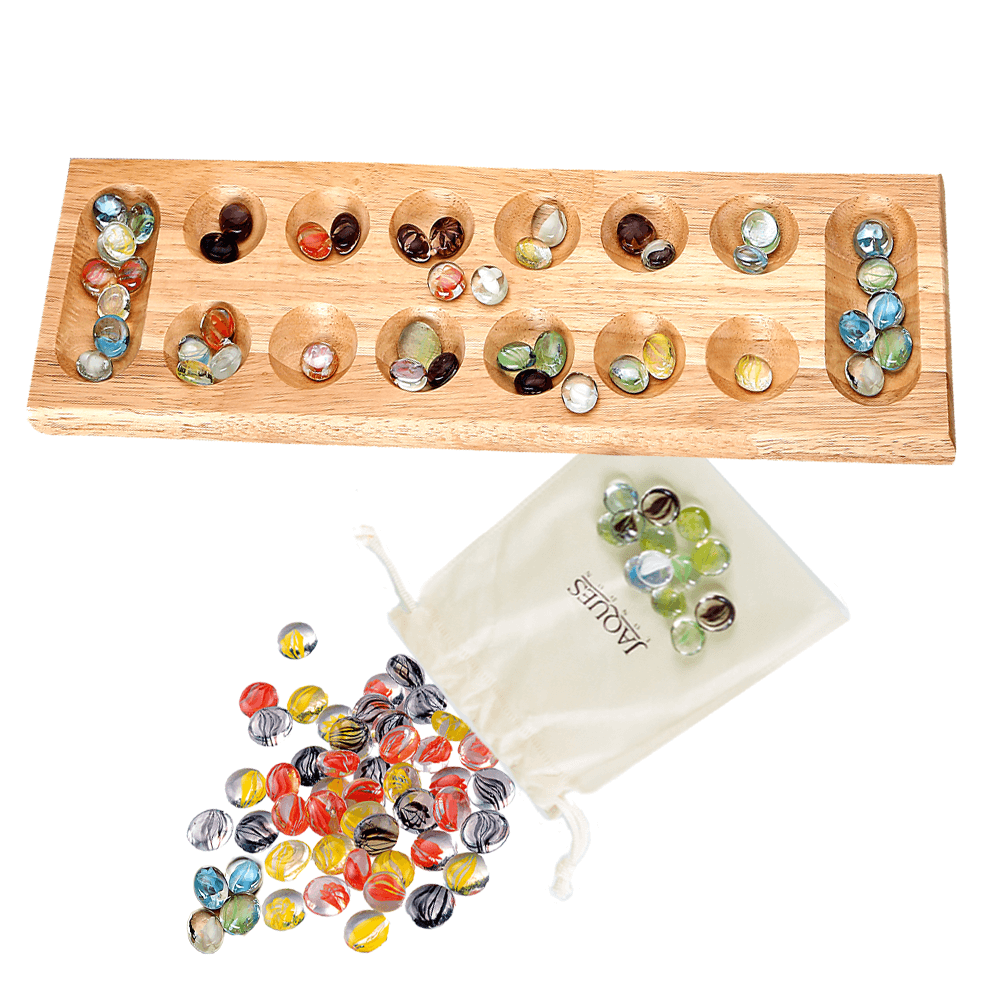

# Mancala

- [Site](http://alexhedley.github.io/mancala/)

You can purchase this from Jaques London: https://www.jaqueslondon.co.uk/products/mancala-board

The object of mancala games is usually to capture more stones than the opponent; sometimes, one seeks to leave the opponent with no legal move or to have your side empty first in order to win.

At the beginning of a player’s turn, they select a hole with seeds that will be sown around the board. This selection is often limited to holes on the current player’s side of the board, as well as holes with a certain minimum number of seeds.